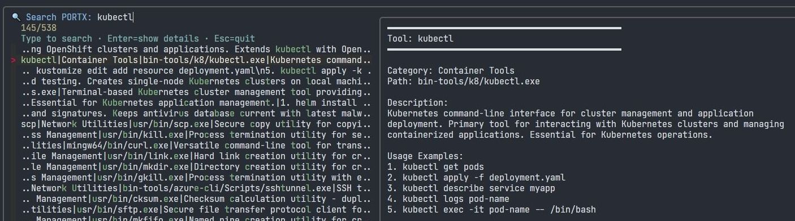
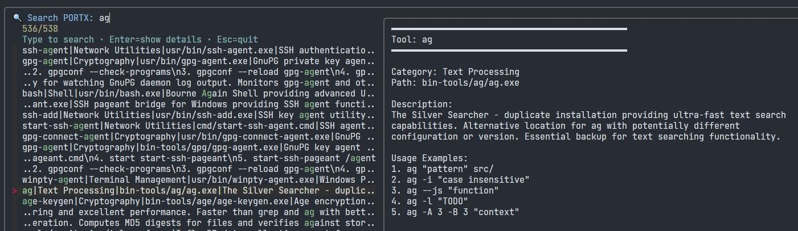
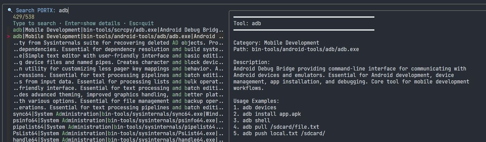
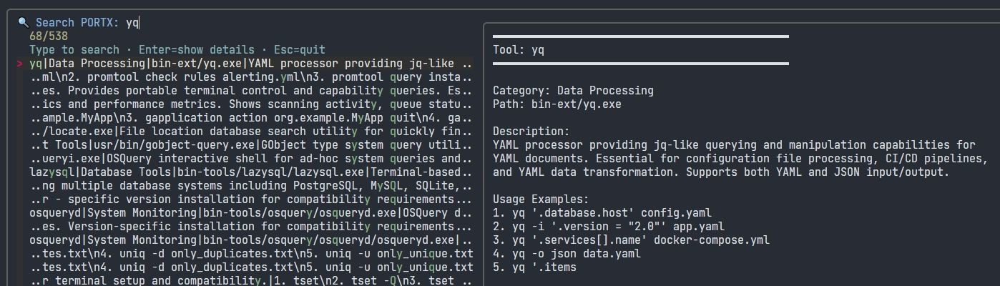
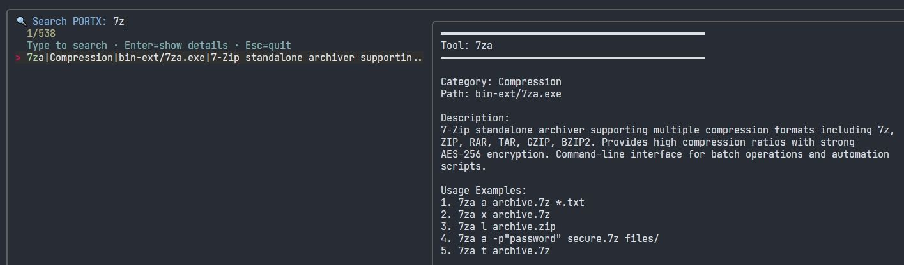
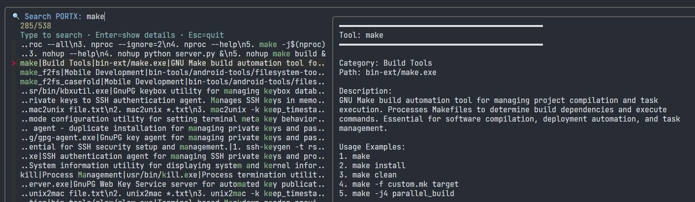
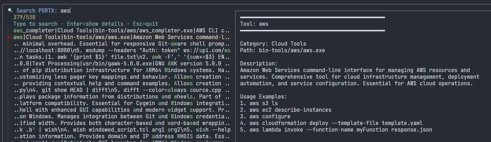

# PORTX - Portable POSIX Environment for Windows

A complete, portable POSIX toolkit built on Git Bash with 538 Windows-native command-line tools. Zero installation, zero dependencies, enterprise-friendly.

## Architecture

PORTX leverages Git for Windows as a corporate-friendly foundation, extending it into a comprehensive POSIX development environment:

**Corporate-Trusted Foundation**: Built on **Git for Windows** (MinGW-w64 + Git Bash), using Microsoft-signed executables already approved in enterprise environments. This provides the critical corporate acceptance that pure MSYS2 or Cygwin installations often lack.

**MinGW-w64 Core**: The underlying MinGW-w64 toolchain provides native Windows POSIX compatibility without emulation layers:
- **Shell Environment**: Bash 4.4+ with complete POSIX shell scripting
- **Unix Utilities**: 284 core tools (ls, grep, awk, sed, tar, curl, ssh, openssl)
- **Native Execution**: Windows PE executables, no cygwin1.dll or compatibility DLLs
- **Path Integration**: Seamless Windows/Unix path translation

**Tool Enhancement Layers**:
- **Core Utilities**: 44 modern CLI tools (ripgrep, bat, fzf, jq, micro, 7za) for improved productivity
- **Professional Suite**: 210 enterprise tools spanning cloud platforms (AWS CLI, Azure CLI), container orchestration (Kubernetes, Docker), infrastructure (Terraform, monitoring), security (ClamAV, YARA, osquery, nuclei), and system analysis (Microsoft SysInternals suite)
- **Development Stack**: Git integration, build tools, and extensible package management

**Corporate Advantages**:
- **Pre-approved Foundation**: Git for Windows signatures bypass security restrictions
- **Zero Installation**: Portable execution from any directory
- **Enterprise Compatibility**: No registry modifications, no administrator privileges required
- **Proven Stability**: Battle-tested codebase used by millions of developers globally

This architecture delivers Unix-grade functionality while maintaining corporate IT approval through its Git for Windows heritage.

## Why Git for Windows is Superior for PORTX

PORTX leverages Git for Windows as its foundational shell environment for compelling technical and enterprise advantages:

### **Key Advantages**

✅ **Native Windows Performance** - 2-9x faster than MSYS2 through MinGW compilation and direct Win32 API usage  
✅ **Enterprise Compatibility** - Pre-approved foundation using Microsoft-signed Git for Windows executables  
✅ **Zero Dependencies** - No external runtime libraries (msys-2.0.dll, cygwin1.dll) or system modifications  
✅ **Portable Architecture** - Self-contained execution model with controlled home directory management  
✅ **Corporate Approval** - Built on trusted Git for Windows infrastructure already deployed in enterprise environments  
✅ **Developer Workflow Optimization** - Git-specific patches and performance enhancements for development tasks  
✅ **Windows Integration** - Native path handling, clipboard access, and process management without emulation overhead  
✅ **AI Development Compatibility** - Reliable execution environment for modern development tools and AI assistants  
✅ **Memory Efficiency** - Minimal footprint without heavy POSIX emulation layers  
✅ **Startup Performance** - Optimized shell initialization for development workflows  

### **Core Principle: Pure Windows Architecture**

PORTX maintains strict architectural purity - all tools must be self-contained Windows executables:

- ❌ **No MSYS2/Cygwin Dependencies**: No external runtime libraries
- ❌ **No System Dependencies**: No external installations or build tools  
- ✅ **Pure Windows PE**: Native Windows executables only
- ✅ **True Portability**: Self-contained directory structure, copy-and-run deployment

For detailed technical analysis, performance benchmarks, and architectural deep dive, see: **[Technical Analysis of Git for Windows Architecture](doc/git-for-windows-architecture.md)**

### **Authoritative Sources**

**Git for Windows Project**:
- **Official Website**: [gitforwindows.org](https://gitforwindows.org/)
- **GitHub Organization**: [github.com/git-for-windows](https://github.com/git-for-windows)
- **Technical Documentation**: [Git for Windows vs MSYS2 Analysis](https://gitforwindows.org/the-difference-between-mingw-and-msys2.html)
- **Architecture Details**: Git for Windows SDK and build system documentation

**MinGW-w64 Foundation**:
- **Official Website**: [mingw-w64.org](https://www.mingw-w64.org/)
- **Technical Specifications**: Complete development environment for native Windows applications
- **Performance Analysis**: "Better-conforming and faster math support compared to Visual Studio"
- **Industry Adoption**: Used by Blender, Boost, FFmpeg, GIMP, LibreOffice, and hundreds of major projects

**Microsoft Official Documentation**:
- **MinGW-w64 on Microsoft Learn**: [learn.microsoft.com/en-us/vcpkg/users/platforms/mingw](https://learn.microsoft.com/en-us/vcpkg/users/platforms/mingw)
- **Windows Subsystem Integration**: Official Microsoft guidance on MinGW-w64 usage

## Key Advantages

**Enterprise Compatible**: No installation required, no registry entries, no administrative privileges needed. Works on locked-down corporate environments.

**Performance**: Native Windows executables without emulation layers. No cygwin1.dll or msys-2.0.dll dependencies.

**Portability**: Self-contained environment runs from any directory. Consistent toolset across different Windows machines.

**Completeness**: Full POSIX shell environment with modern tooling. Covers development, DevOps, security, and system administration workflows.

**Integration**: Tools work together seamlessly through proper PATH configuration and shared environment variables.

## Tool Categories

**Development**: Git, GCC compiler suite, text editors (micro, helix), build tools (make), language runtimes

**DevOps**: AWS CLI, Azure CLI, Terraform, Kubernetes (kubectl, helm, k9s), Docker Compose, monitoring tools

**Security**: ClamAV antivirus, YARA malware detection, osquery endpoint monitoring, hash utilities (hashdeep, ssdeep), network scanning (nuclei)

**System Analysis**: Microsoft SysInternals command-line tools (psinfo, handle, pslist, accesschk, procdump, strings) for Windows system diagnostics and troubleshooting

**Windows Automation**: NirCmd utility for Windows system control, automation, clipboard management, volume control, window management, and speech synthesis

**Text Processing**: Traditional Unix tools (grep, sed, awk) plus modern alternatives (ripgrep, bat, fd, sd), JSON/YAML processors (jq, yq)

**System Administration**: Process monitoring (btop), file management (7za), network utilities (curl, SSH), remote access tools

## Tool Discovery & Research Methodology

PORTX includes a comprehensive tool discovery system with scientifically curated documentation for all 538 tools:

### Discovery Interface

**Interactive Tool Finder** (`portx-find-tools`): Real-time search and browse interface using fzf with:
- Full-text search across tool names, categories, and descriptions
- Live preview with detailed usage examples
- Tool availability verification
- Category-based filtering and statistics

**Category Browser** (`portx-category`): Organized navigation through 18 professional categories:
- Network Utilities, Security Tools, Development Tools, Database Management
- Text Processing, System Administration, Cryptography, Cloud Platforms
- Container Orchestration, Infrastructure as Code, and specialized tool suites

### Research & Curation Process

**Systematic Tool Analysis**: Each of the 538 tools underwent individual research:
1. **Source Documentation Review**: Official manuals, GitHub repositories, vendor documentation
2. **Functional Classification**: Categorization based on primary use case and professional domain
3. **Usage Pattern Analysis**: Real-world command examples and common workflows
4. **Compatibility Verification**: Windows-native execution testing and dependency analysis

**Quality Assurance Standards**:
- **Zero Generic Descriptions**: Every tool has specific, researched functionality descriptions
- **Comprehensive Examples**: 5-10 practical usage examples per tool with real commands
- **Professional Categorization**: Industry-standard taxonomy aligned with DevOps and enterprise workflows
- **Continuous Validation**: Automated availability checking and path verification

**Data Structure**: Tools database maintained in pipe-delimited format:
```
tool_name|category|full_path|detailed_description|usage_examples
```

**Extraction Methodology**: Automated deep-scan algorithm traversing 53 directories with 4-level depth analysis:
- Minimum 1 executable per directory requirement
- PATH optimization for 284 total executables
- Smart caching system with regeneration triggers
- Integration with Git Bash environment variables

This scientific approach ensures PORTX provides enterprise-grade tool discovery with professional documentation standards comparable to commercial development environments.

## Screenshots

<div align="center">
















</div>

## Quick Start

1. Extract PORTX to any directory
2. Run `portx.bat` to launch the environment
3. Access tools via standard Unix commands or Windows paths
4. Use `portx-tools find` for interactive tool discovery

## Technical Specifications

**Shell Environment**: Bash 4.4+ with POSIX compatibility layer
**Home Directory**: Portable user environment with SSH, Git configuration
**PATH Management**: Hierarchical tool discovery across bin/, bin-ext/, bin-tools/
**File System**: Unix-style paths with Windows compatibility layer
**Process Management**: Native Windows process handling with Unix signals

PORTX delivers enterprise-grade Unix functionality on Windows without the complexity or security concerns of traditional emulation approaches.