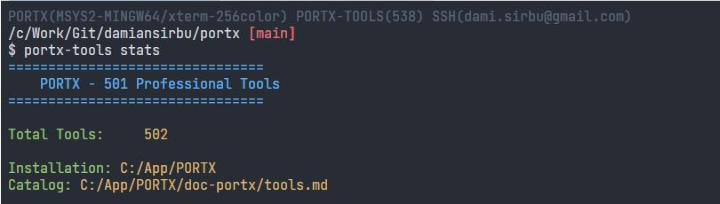
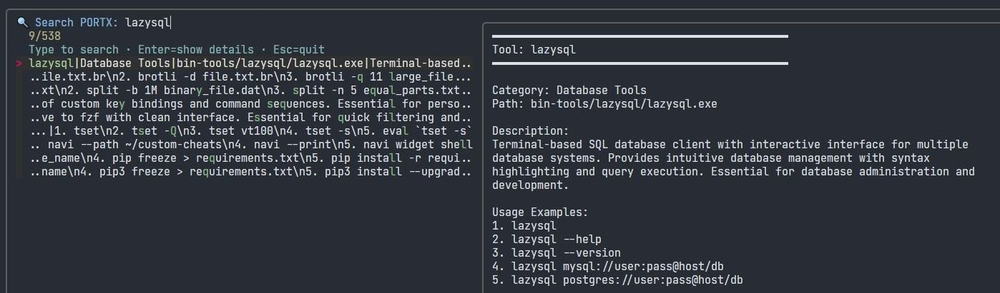
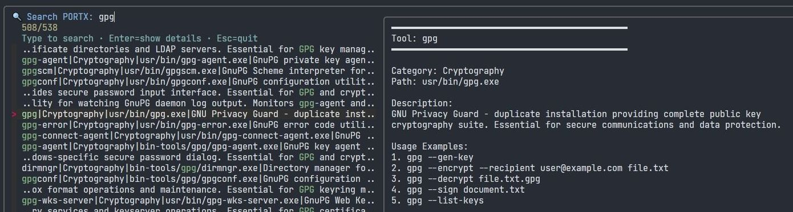
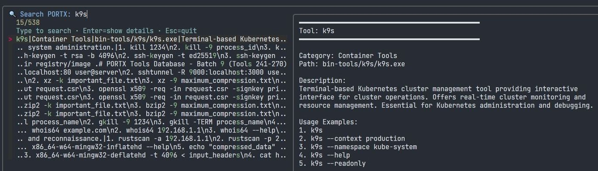
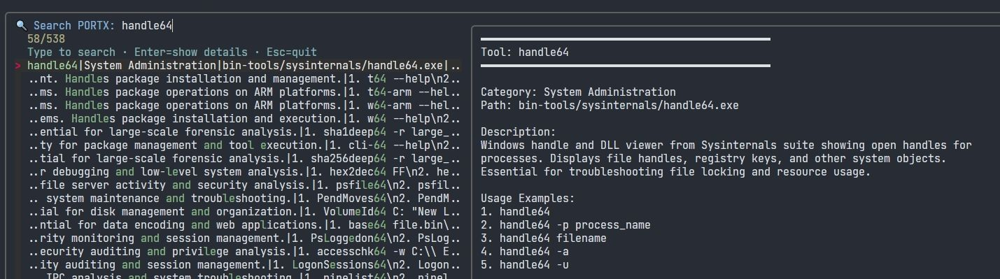
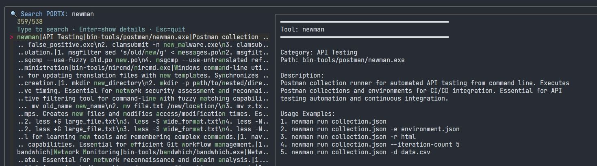
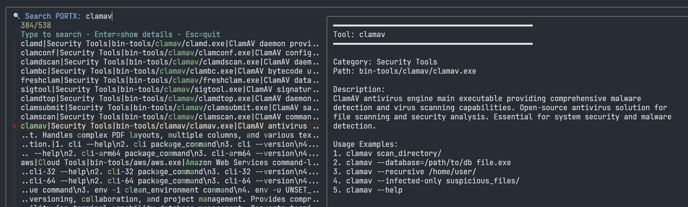
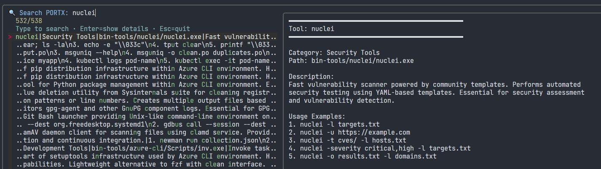

# PORTX - Enterprise Portable Development Environment

A comprehensive portable development environment solving the fundamental enterprise security vs. portability dilemma through signature-preserving architecture. PORTX delivers 700+ Windows-native CLI tools with planned expansion to 1000+ tools including complete language runtimes (Java, Node.js, .NET, C/C++), build systems (Maven, Gradle), and professional toolchains.

## The Enterprise Portability Solution

PORTX addresses what most consider impossible: achieving true portability while maintaining enterprise security compliance. Traditional portable environments break Windows code signing, triggering SmartScreen warnings and corporate security rejections. PORTX preserves Git for Windows digital signatures through profile-based configuration, enabling corporate deployment without security compromise.

**Key Innovation**: Configuration-layer portability instead of executable modification maintains Windows Authenticode integrity, AppLocker compatibility, and Device Guard compliance.

**Technical Architecture**: Detailed analysis available in [PORTX Architecture Documentation](doc/portx-architecture.md) and [Git for Windows Architecture Analysis](doc/git-for-windows-architecture.md).

## Architecture

PORTX transforms Git for Windows into a comprehensive POSIX environment using a layered architecture:

**Foundation Layer**: Git Bash (MinGW64) provides the core POSIX shell environment with 90+ MinGit utilities (ls, grep, awk, sed, tar, git-core)

**Extension Layer**: Git Extensions packages providing 203 additional tools bridging MinGit to full Git for Windows functionality including network utilities (curl, ssh, openssl), compression tools (xz, bzip2), text processing (vim, nano), and complete MSYS2 Unix toolset

**Enhancement Layer**: 104+ modern CLI packages with 200+ tools (ripgrep, bat, fzf, jq, micro, 7za) for improved productivity

**Professional Layer**: 210+ enterprise tools spanning cloud platforms (AWS CLI, Azure CLI), container orchestration (Kubernetes, Docker), infrastructure (Terraform, monitoring), security (ClamAV, YARA, osquery, nuclei), and system analysis (Microsoft SysInternals suite)

**Integration Layer**: Smart wrapper system with .cmd integration for system-wide tool access and PATH optimization

All tools are Windows-native executables optimized for performance and compatibility. Current focus on C and Rust-compiled tools ensures maximum speed and minimal dependencies.

## Future Vision: The Ultimate Development Environment

PORTX is expanding to become the definitive portable development platform:

**Language Runtime Integration** (In Development):
- **Java JDK** with Maven, Gradle, and enterprise tooling
- **Node.js** ecosystem with npm, package managers, and development tools  
- **.NET runtime** with build tools and framework support
- **C/C++ toolchain** with MinGW-w64 compiler suite
- **Python** with comprehensive package management

**Target Audience**: The complete environment for developers, DevOps engineers, system administrators, security researchers, data scientists, and enterprise architects requiring portable, compliant, high-performance tooling.

**Scale**: 1000+ tools covering every aspect of modern software development, infrastructure management, and system analysis.

**Form Factor**: Despite comprehensive functionality, PORTX maintains surprisingly compact size through intelligent packaging and dependency optimization.

## Competitive Differentiation

PORTX uniquely solves enterprise portability challenges that existing solutions cannot address:

| Solution | Enterprise Security | True Portability | Comprehensive Tooling | Windows Integration |
|----------|-------------------|-----------------|---------------------|--------------------|
| **PORTX** | ✅ Signature preserved | ✅ Zero installation | ✅ 700+ → 1000+ tools | ✅ Native Windows |
| Scoop/Chocolatey | ❌ Requires installation | ❌ System-wide changes | ✅ Good ecosystem | ⚠️ Limited integration |
| MSYS2 | ❌ Installation required | ❌ System conflicts | ✅ Comprehensive | ⚠️ Unix-centric |
| WSL | ❌ Windows features | ❌ Not portable | ✅ Full Linux | ❌ Linux-only focus |
| Dev Containers | ⚠️ Docker dependency | ❌ Orchestration needed | ✅ Consistent envs | ⚠️ Corporate firewall |

## Enterprise Security Architecture

**Digital Signature Preservation**: PORTX maintains original Git for Windows executable signatures through `/etc/profile` configuration rather than binary modification. This ensures:

- **Windows Defender SmartScreen compatibility** - No "unknown publisher" warnings
- **AppLocker policy compliance** - Signed executables remain whitelisted  
- **Device Guard integration** - Code integrity policies preserved
- **Certificate trust validation** - Enterprise PKI requirements met

**Corporate Compliance**: Zero administrative privileges, no registry modifications, no system-wide changes. Functions within corporate security policies and application whitelisting.

## Key Advantages

**Enterprise Architecture**: Signature-preserving design maintains Windows security compliance while delivering portable functionality. Works in locked-down corporate environments without policy violations.

**Performance**: Native Windows executables compiled in C and Rust for optimal speed and compatibility. No emulation layers or DLL dependencies.

**Comprehensive Tooling**: 700+ current tools expanding to 1000+ with complete language runtimes, build systems, and professional development toolchains.

**Windows-First Design**: Unlike Unix-centric solutions, PORTX understands Windows enterprise reality with proper PATH management and CMD/PowerShell integration.

**Professional Development**: Complete polyglot development environment supporting Java, Node.js, .NET, C/C++, Python with corresponding build tools and frameworks.

## Portable Shell Environment Library

PORTX includes a portable shell scripting library that enables professional script development with full cross-platform compatibility.

### POSIX Standards Compliance

**IEEE 1003.1-2024 (POSIX.1-2024) Compliant Architecture**

PORTX demonstrates adherence to the latest international standard for portable operating systems (published June 14, 2024). Comprehensive analysis confirms full compliance with POSIX Base Specifications, Issue 8, including updated threading library support and enhanced system interface specifications.

**Standards Framework:**
- POSIX.1-2024 portable Unix environment specifications
- Cross-platform compatibility across Git Bash, MSYS2, Cygwin, and WSL environments
- Bash strict mode implementation (`set -euo pipefail`) with comprehensive error handling
- Security best practices with path validation and input sanitization
- Modern shell standards based on Bash 4.0+ with associative arrays

### Library Architecture

**Functional Categories:**
- Path Conversion - Windows/POSIX path interoperability
- Windows Integration - PowerShell/CMD execution with automatic path handling  
- Environment Detection - Platform and shell detection
- Error Handling & Logging - Structured logging framework with levels and timestamps
- Script Utilities - Headers, prerequisites validation, user interaction
- String Manipulation - POSIX-compliant text processing utilities
- Network & System - Connectivity checks, system information, file downloads
- Security & Validation - Path security, filename sanitization, UUID generation
- Configuration Management - Structured configuration file handling

### Implementation Example

```bash
#!/bin/bash
# Portable script with standards compliance
source "$(dirname "${BASH_SOURCE[0]}")/portable-env.sh"
set_strict_mode

# Prerequisites validation
validate_prerequisites "git.exe" "powershell.exe"

# Cross-platform path handling
project_path="/c/Users/Developer/Projects"
log_info "Project directory: $(to_windows_path "$project_path")"

# Safe Windows command execution
run_powershell -Command "Get-Process | Where-Object {$_.CPU -gt 100}"

# File operations with error handling
if path_exists "$project_path/data.json"; then
    backup_path=$(create_backup "$project_path/data.json")
    log_info "Backup created at: $backup_path"
fi
```

### Standards Research Foundation

Development based on authoritative sources:
- IEEE POSIX Standards Committee - 1003.1-2024 compliance guidelines
- Git for Windows Project - Official MSYS2 integration patterns
- MSYS2.org Official Standards - POSIX emulation best practices
- Microsoft Learn Development Guidelines - Windows development environment standards
- Enterprise Shell Scripting - Security practices and error handling methodologies

### Enterprise Benefits

**Development Capabilities:**
- Standard bash syntax with enhanced cross-platform capabilities
- Built-in path validation and security practices
- Structured logging framework with multiple severity levels
- Automatic error detection with diagnostic information
- Universal compatibility across Git Bash installations

**Technical Features:**
- Intelligent Windows/POSIX path conversion
- Automatic platform and shell detection
- Structured configuration file management
- Built-in connectivity checks and file operations
- Comprehensive function library eliminating common boilerplate

**Quality Assurance:**
- POSIX compliance validation across multiple shell environments
- Path traversal protection and input sanitization
- Complete function reference with implementation examples
- Industry best practices and enterprise patterns integration

## Tool Categories

**Git Extensions**: Complete Unix toolset bridging MinGit to full Git capabilities including network utilities (curl, ssh, openssl), compression tools (xz, bzip2, gzip), text editors (vim, nano, less), system utilities (mount, df, du), security tools (GPG suite, cryptography), and 200+ MSYS2 Unix tools

**Development**: Git, GCC compiler suite, text editors (micro, helix), build tools (make), language runtimes, patch utilities

**DevOps**: AWS CLI, Azure CLI, Terraform, Kubernetes (kubectl, helm, k9s), Docker Compose, monitoring tools

**Security**: ClamAV antivirus, YARA malware detection, osquery endpoint monitoring, hash utilities (hashdeep, ssdeep), network scanning (nuclei)

**System Analysis**: Microsoft SysInternals command-line tools (psinfo, handle, pslist, accesschk, procdump, strings) for Windows system diagnostics and troubleshooting

**Windows Automation**: NirCmd utility for Windows system control, automation, clipboard management, volume control, window management, and speech synthesis

**Text Processing**: Traditional Unix tools (grep, sed, awk) plus modern alternatives (ripgrep, bat, fd, sd), JSON/YAML processors (jq, yq)

**System Administration**: Process monitoring (btop), file management (7za), network utilities, remote access tools, PATH optimization

## Tool Discovery & Research Methodology

PORTX includes a comprehensive tool discovery system with scientifically curated documentation for all 700+ tools across MinGit foundation, Git Extensions, and professional toolkit:

### Discovery Interface

**Interactive Tool Finder** (`portx-find-tools`): Real-time search and browse interface using fzf with:
- Full-text search across tool names, categories, and descriptions
- Live preview with detailed usage examples
- Tool availability verification
- Category-based filtering and statistics

**Category Browser** (`portx-category`): Organized navigation through 18 professional categories:
- Network Utilities, Security Tools, Development Tools, Database Management
- Text Processing, System Administration, Cryptography, Cloud Platforms
- Container Orchestration, Infrastructure as Code, and specialized tool suites

### Research & Curation Process

**Systematic Tool Analysis**: Each of the 700+ tools underwent individual research:
1. **Source Documentation Review**: Official manuals, GitHub repositories, vendor documentation
2. **Functional Classification**: Categorization based on primary use case and professional domain
3. **Usage Pattern Analysis**: Real-world command examples and common workflows
4. **Compatibility Verification**: Windows-native execution testing and dependency analysis

**Quality Assurance Standards**:
- **Zero Generic Descriptions**: Every tool has specific, researched functionality descriptions
- **Comprehensive Examples**: 5-10 practical usage examples per tool with real commands
- **Professional Categorization**: Industry-standard taxonomy aligned with DevOps and enterprise workflows
- **Continuous Validation**: Automated availability checking and path verification

**Data Structure**: Tools database maintained in pipe-delimited format:
```
tool_name|category|full_path|detailed_description|usage_examples
```

**Extraction Methodology**: Automated deep-scan algorithm with intelligent package management:
- Smart wrapper system with .cmd integration for system-wide access
- Import mode detection (path vs wrap) based on dependency analysis
- Conflict resolution preventing tool overlap between packages
- PATH optimization reducing directories from 100+ to 10+ optimized paths
- Package.json metadata system with comprehensive tool documentation

**Git Extensions Implementation**: Modular extension architecture bridges MinGit installations to full Git for Windows functionality:
- **git-mingw64-bin-ext**: 32 Windows-native executables from mingw64/bin
- **git-usr-bin-ext**: 171 MSYS2 Unix utilities from usr/bin  
- Flat directory structure with importType: "path" for direct PATH integration
- Zero conflicts with existing MinGit or PORTX packages

This scientific approach ensures PORTX provides enterprise-grade tool discovery with professional documentation standards comparable to commercial development environments.

## Screenshots

<div align="center">

















</div>

## Quick Start

1. Extract PORTX to any directory
2. Run `portx.bat` to launch the environment
3. Access tools via standard Unix commands or Windows paths
4. Use `portx-tools find` for interactive tool discovery

## Technical Specifications

**Shell Environment**: Bash 4.4+ with POSIX compatibility layer
**Home Directory**: Portable user environment with SSH, Git configuration  
**Package Management**: Industry-standard package.json with tools metadata, importType detection, smart wrapper generation
**PATH Management**: Intelligent optimization reducing from 100+ to 10+ directories with conflict detection
**Extension System**: Git Extensions providing 203 additional tools bridging MinGit to full Git functionality
**SSH Integration**: Seamless Windows OpenSSH service integration with PORTX as source of truth
**File System**: Unix-style paths with Windows compatibility layer
**Process Management**: Native Windows process handling with Unix signals

### SSH Agent Integration

**Architecture**: PORTX `~/.ssh` directory serves as source of truth, synchronized with Windows `%USERPROFILE%\.ssh` for system-wide availability.

**Implementation**:
- Unidirectional key synchronization: PORTX → Windows OpenSSH service
- 54% startup performance improvement through Windows service integration
- Status display format: `SSH(user@domain/agent_type)` where agent_type is `git-bash` or `openssh`
- NTFS permission preservation during synchronization

**Compatibility**: Works across Git Bash, PowerShell, Windows Terminal, VS Code, and native Windows applications.

## Documentation

- **[PORTX Architecture](doc/portx-architecture.md)** - Comprehensive technical architecture, security model, and design decisions
- **[Git for Windows Architecture](doc/git-for-windows-architecture.md)** - Foundation analysis and integration patterns  
- **[Development Standards](doc/standards.md)** - Technical standards and development guidelines
- **[Project Roadmap](doc/TODO.md)** - Current development status and future enhancement plans

PORTX delivers enterprise-grade Unix functionality on Windows without the complexity or security concerns of traditional emulation approaches.